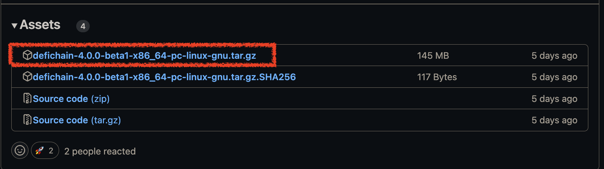

# Run a Local Node in Changi

### Get the binaries

Got to the [official DeFiChain](https://github.com/DeFiCh/ain/releases) and look for the latest version of the node.


Then click on the Assets dropdown at the end of each release section. Then select the binaries for your Operating System.



> Note that for version v4.0.0-beta1 there are only Linux binaries. Future releases will be handing also OSX ans Windows binaries.

Once you have downloaded the binaries extract then to your desired directory. You should see three files inside the bin folder:

- `defid`: DeFiChain node
- `defi-cli`: Command line interface to interact with the node
- `defi-tx`: utility tool to build and sign transactions on DeFiChain

For the porpuse of this guide we will only be using defid and defi-cli.

### Runing the node

To run the node just run the `defid` binary with he `-changi` flag

```bash
defid -changi
```

> If you want `defid` to run as a deamon (in the background) add the `-daemon` flag to the command above. Also if you want to have additional debug information about the EVM add `RUST_LOG=debug` to the begining of the command.
>
> `RUST_LOG=debug defid -changi --daemon`

Once the node is running it should start syncing. The process of syncing can take up to a cuple of hours depending on your machione so just be patient.

To check if the node is synced you can open a new terminal, run the following command and check if the fields `blocks` and `headers` are equal:

```bash
defi-cli getblockchaininfo | head
```


### Connect Metamask.

To connect to metamask the process is the same as the one described in [Connect Metamask to Floppynet](./guide_floppynet_short.md) and in [point 4](./guide_floppynet_short.md#4-fill-network-form-with-connection-data) use the Changi Testnet connection data below. For now only the Chain Id and the optional block explorer in the Changi Testnet are different:

| Network | RPC URL | Chain ID | Block Explorer |
|---------|---------|----------|----------------|
|Changi Testnet| http://localhost:20551| 1133 | https://testnet-dmc.mydefichain.com:8444 |

### Faucet

To get you Changi Testnet DFI you can use the faucet provided by the community at [http://tc04.mydefichain.com/faucet/](http://tc04.mydefichain.com/faucet/)


