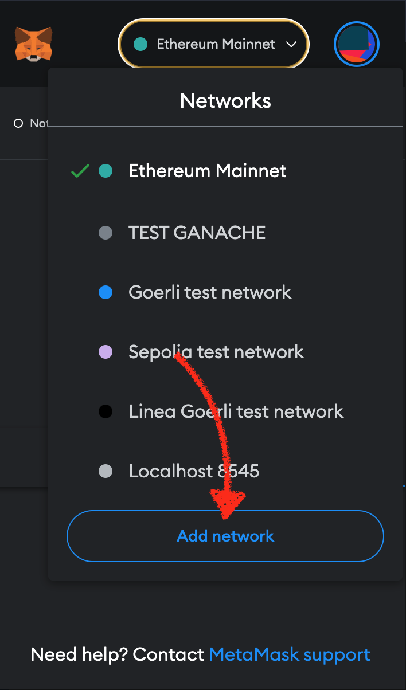

# Connect Metamask to Changi TestNet

### To connect to MetaChain follow this four steps:

#### 1. Open network dropdown.
<p align="center">
  
</p>

#### 2. Add network
<p align="center">

</p>

#### 3. Add network manually
<p align="center">

</p>

#### 4. Fill network form with connection data

Connection data:

- Network name: **MetaChain**
> ⚠️ **Warning: Due to potential network overloads, it is advised to use a local node over the public node to connect with Metamask. Follow the guide: [Run a Local Node in Changi](./guide_changi.md).**

| Network | RPC URL | Chain ID | Currency symbol | Block Explorer (Optional) |
|---------|---------|----------|----------------|----------------|
|Changi Testnet / Managed Node| https://changi.dfi.team | 1133 | DFI | https://meta.defiscan.live |
|Changi Testnet / Local Node | https://127.0.0.1:20551 | 1133 | DFI | https://meta.defiscan.live |

<p align="center">

</p>

<p align="center">
  
</p>

### That's it!
To get some DFI, head to [DeFiChain's Developer Discord](https://docs.google.com/forms/d/e/1FAIpQLSdAo1WuOfeZv3HyZPCRbqzkGggI1JefdEtCnZbdv_RnWs0wdw/viewform), apply to join the Discord, if your application is successful use the `#testnet-faucet` channel and drop a message with your address, amount and reason like so:

```
Address: 0x20b50961f7ce10F70874f358d54343cB388D3b71
Amount: 50DFI
Reason: Test Smart Contracts NFT Marketplace
```
