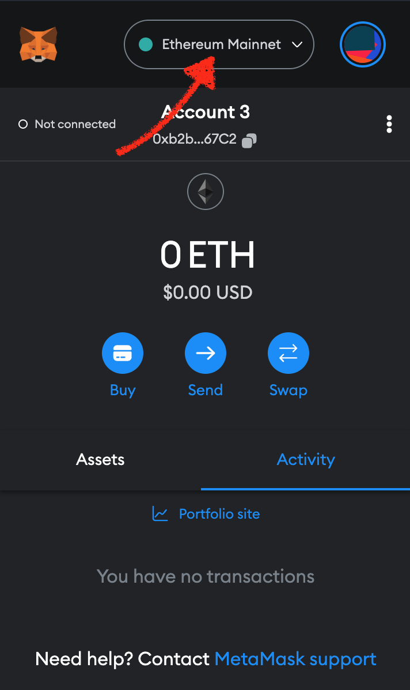
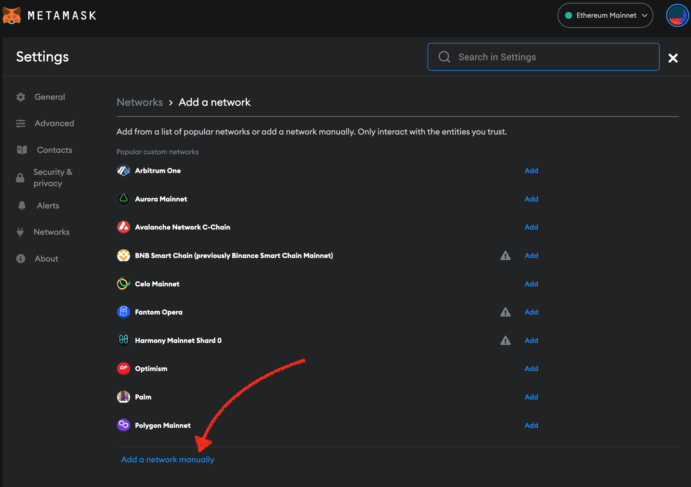
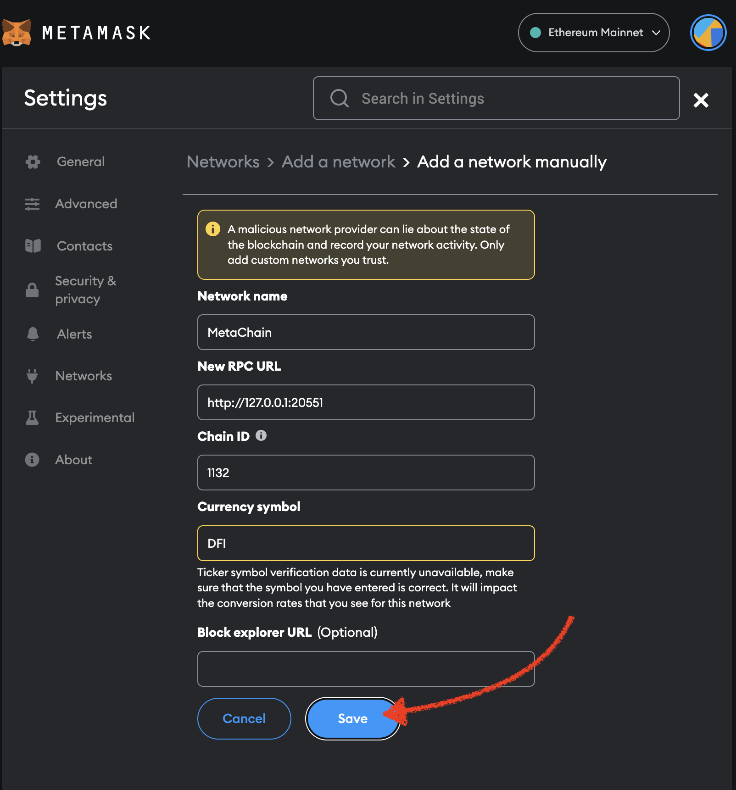

# Connect Metamask to Floppynet

> ✏️ **Note:**
> FloppyNet is an ALPHA stage test network, which means it may be subject to changes.
> The network may experience execution failures and data persistence issues. Rollbacks are likely to happen periodically.**

### To connect to MetaChain follow this four steps:

#### 1. Open network dropdown.
<p align="center">

</p>

#### 2. Add network
<p align="center">

</p>

#### 3. Add network manually
<p align="center">

</p>

#### 4. Fill network form with connection data

Connection data:

- Network name: **MetaChain** (or whatever name you prefer)
> ⚠️ **Warning: Due to potential network overloads, it is advised to use a local node over the public node to connect with Metamask. Follow the guide: [Run a Local Node in Floppynet](./guide_floppynet.md).**

- Local node (Recomended):
    - New RPC URL: **http://127.0.0.1:20551** or **http://localhost:20551**
- Public node:
    - New RPC URL: **http://35.187.53.161:20551**
> ✏️ **Note:**
> The public node is temporarily hosted by the core team for the easy access and convenience of early testers, and it is subject to change.

- Chain ID: **1132** (Specific to Floppynet)
- Currency symbol: **DFI**
- Block explorer URL: leave blank for now

<p align="center">


</p>

### That's it!
Now you can switch to the MetaChain network and see your new account, transfer funds and call and deploy smart contracts.
To get some DFI, head to [DeFiChain's Slack](https://join.slack.com/t/defichain/shared_invite/zt-1vpyeesl3-iUa1aMjW4fCt0W53g2y46Q), join the `#testnet-faucet` channel and drop a message with your address, amount and reason like so:

```
Address: 0x20b50961f7ce10F70874f358d54343cB388D3b71
Amount: 50DFI
Reason: Test Smart Contracts NFT Marketplace
```
