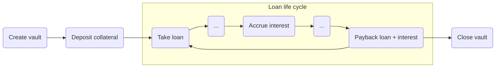

# Loans

# Table of contents

1. [Introduction](#1-introduction)
1. [Loans in DeFiChain](#2-loans-in-defichain)
1. [Main concepts](#3-main-concepts)
    * [Collateral](#collateral)
        * [Collateralization ratio](#collateralization-ratio)
        * [Over-collateralization](#over-collateralization)
        * [Collateralization factor](#collateralization-factor)
    * [Minting](#minting)
    * [Loan scheme](#loan-scheme)
        * [Minimum collateralization ratio](#minimum-collateralization-ratio)
        * [Interest rate](#interest-rate)
    * [Price and Fixed Interval Price](#price-and-fixed-interval-price)
    * [Liquidation](#liquidation)
        * [Liquidation penalty](#liquidation-penalty)
    * [Vault](#vault)
        * [Vault state](#vault-state)
        * [50% rule](#50-rule)
    * [Auction](#auction)
        * [Auction batch](#auction)
        * [Example](#example)
        * [Collateral auction example](#collateral-auction-example)
        * [Failed auction](#failed-auction)
1. [RPC](#4-rpc)
    * [Loan scheme RPCs](#loan-scheme-rpcs)
    * [Loan tokens RPCs](#loan-tokens-rpcs)
    * [Collateral tokens RPCs](#collateral-tokens-rpcs)
    * [Vault RPCs](#vault-rpcs)
    * [Auction RPCs](#auction-rpcs)
    * [Helper RPCs](#helper-rpcs)

# 1. Introduction

In this document we will try to understand how loans work inside DeFiChain and how they differ from traditional lending services in CeFi (Centralized Finance).


> **NOTE**
>
> We will be speaking a lot about **amount** and **value** when talking about dTokens, collaterals, loans and interests. It is important to make clear the difference between both.
>
> Amount is the quantity of the referred asset and value is the conversion to $ taken from the oracles.
>
> To make this more clear lets see an example:
>
>> Given 10dTSLA with each tesla priced at 100$:
>>
>> Amount = 10
>>
>> Value = 10dTSLA * 100$ = 1000$

This documentation is in continuous development, feel free to open an issue or Pull Request to the [official repository](https://github.com/DeFiCh/handbook).

# 2. Loans in DeFiChain

To better understand the difference between DeFiChain loans and traditional loans lets start by looking at the definition of traditional *loan* by the Cambridge Dictionary:

>> *Loan: An amount of money that is borrowed, often from a bank, and has to be paid back, usually together with an extra amount of money that you have to pay as a charge for borrowing*

Lets adjust this definition to fit in the DeFiChain's implementation of loans.

> *"an amount of money that is borrowed, often from bank, and has to be paid back..."*.

When operating in DeFiChain it is more accurate to talk about loan tokens or dTokens instead of borrowed money as all operations regarding loans. Moreover, loan tokens are not borrowed like in traditional finance as there is no one lending the assets in the other side. Instead, loan tokens are [minted](#minting), this is how we call the process to create new dTokens on the blockchain.

For a better understanding of dTokens please have a look at this [blog post](https://blog.defichain.com/what-are-decentralised-stock-tokens-and-how-do-they-work/). For now lets say, *borrowed money*=loan tokens.

Continuing with the adaptation of the definition, in DeFi (Decentralized finance) there are no central authorities so we can remove any reference to banks. Again, the key part to understand here is that there is not one specific person nor entity approving or rejecting a loan, the network through consensus rules and algorithms will be in charge of providing users for their loans tokens.

The last part *"...and has to be paid back."* needs also some refactoring as in DeFiChain **loans have no due date**. In DeFiChain loans need to be backed up by collateral tokens value. We can spot a similar behaviour in traditional finance where the bank asks for a deposit of value as a guarantee (a house, a car...) in return of a certain amount of money.

Applying the changes mentioned, our definition of loan is now:

> An amount of loan tokens that is minted, ~~often from a bank~~, and which value has to be backed up by collateral during the loan's life cycle.

The loan's life cycle ends when a loan is fully paid back, i.e. all dTokens + interests are returned to the vault.



Now lets continue to the second part of the initial definition:

> *"...usually together with an extra amount of money that you have to pay as a charge for borrowing"*

This part talks about **interests** and of course DeFiChain loans also generate interests. Each vault subscribes to a [loan scheme](#loan-scheme), this loan scheme sets the amount of interest that the minted tokens will generate. Also dTokens can be set to generate interests themselves regardless the vault they operate in. This is explained in detail in the [interests](#interests) definition.

Now we are finished with the adaptation of the definition to suit the DeFiChain implementation of loans, lets have a look at the final result:

> An amount of dToken that is minted and which value + interests has to be backed up by collateral during the loan's life cycle.

# 3. Main concepts

In this section you will find a detailed explanation of the concepts and key aspects regarding loans in DeFiChain.

## Collateral

Collateral is the guarantee deposited into a [vault](#vault) that let vault owners mint dTokens in DeFiChain i.e., take a loan. This collateral will be locked in the vault until a [withdraw]() or [closevault](#closevault) operation succeeds.

### Collateralization ratio

The collateralization ratio is the value of the deposit with respect to the value of the minted or loan tokens plus the interests.

It is calculated using the following formula:

```
Collateralization ratio =
    Total value of collateral /
    (Total value of tokens minted + Total value interest)
```

### Over-collateralization

Vaults follow an over-collateralization mechanism, i.e., the value of the collateral locked in a vault must be of greater value than the one of the minted dTokens + the interests. How much a vault must be over-collateralized is defined by the [minimum collateralization ratio](#minimum-collateralization-ratio). This is set by the [loan scheme](#loan-scheme) the vault subscribes to.

### Collateralization factor

Assets that are accepted for collateralization could be accepted at different collateralization factors, from 0% to 100%. When an asset's collateralization factor is 100%, the entirety of the asset's value contributes to the collateralization value of the vault, however, if an asset's collateralization factor is say 50%, then only half of its value contributes to the total vault's collateral.

For example if `DOGE` is accepted at 70% collateralization factor, $100 worth of `DOGE` would contribute to $70 of collateral value in a vault.

This is not to be confused with [*collateralization ratio*](#collateralization-ratio).

## Minting

Minting dTokens is the process by which dTokens are created in DeFiChain. dTokens in DeFiChain can be minted by creating a vault, depositing collateral and taking a loan. As vaults are over-collateralized, this process ensures that all dTokens are backed up by the collaterals locked in vaults at all times.

This loaned tokens can be freely used for other purposes like adding liquidity to a pool, swaping in a liquidity pool or transfer to another address.

## Loan scheme

Loan schemes are structures that define the conditions vaults adhere to.

A loan scheme has the following information:

* An `Id` (String) used as a unique identifier of the loan scheme.
* A `minimum collateralization ratio` (Natural number greater or equal to 100)
* An `interest rate` (positive rational number from 0-100)

Lets see some examples of possible loan schemes:
* Id: "LOAN150". Min collateralization ratio: 150%. Interest rate: 5% APR.
* Id: "LOAN175". Min collateralization ratio: 175%. Interest rate: 3% APR.
* Id: "LOAN200". Min collateralization ratio: 200%. Interest rate: 2% APR.
* Id: "LOAN350". Min collateralization ratio: 350%. Interest rate: 1.5% APR.
* Id: "LOAN500". Min collateralization ratio: 500%. Interest rate: 1% APR.
* Id: "LOAN1000". Min collateralization ratio: 1000%. Interest rate: 0.5% APR.

Following the above list, a vault subscribed to "LOAN150" would need to have always a [collateralization ratio](#collateralization-ratio) over 150% and it's loans will generate a 5% interest per year.

## Price and fixed interval price

Price in DeFiChain can be found in two forms:

* DEX price: obtained by the balance inside the liquidity pools.
* Oracle price: retrieved from the actual asset represented by the dToken outside DeFiChain.

Oracles are trusted services that inject this prices directly into DeFiChain. Read more about oracles [here](../pinkpaper/price-oracle).

The important thing to understand here is that these prices are different and each is used for different purposes. For instance, when we talk about value, this is calculated with the oracle price and not with the DEX price. DEX price in the other hand is used when swapping between dTokens and DFI to burn the interests or the penalty generated by a vault being liquidated.

### Fixed Interval Price

Is a mechanism to provide users time to prevent the liquidation of their vaults when the price of the collateral tokens or loan tokens is unstable. This is achieved by fixing the price of the tokens each 120 blocks (~1 hour) for vault calculations.

There are in reality three prices for each dToken all of them taken from the oracles:

<div id="active-price"></div>

* `Active price`: the price used for [collateralization ratio](#collateralization-ratio) calculation.
<div id="current-price"></div>

* `Current price`: this is the live price of the oracle used to calculate the dTokens that can be minted within a vault at the time of taking the loan.
<div id="next-price"></div>

* `Next price`: the next price that will be used for calculations, i.e. the next price that will become active.

<div id="invalid-price"></div>

Token price feeds become invalid in the following scenarios:

* Active price and next price deviation is over 30%
* Active price is 0.
* Next price is 0.
* There are less than two active oracles for that price feed.

### Minimum collateralization ratio

This is one of the most important aspects to understand vaults functioning and to do a proper risk management of your loans. The minimum collateralization ratio sets a threshold that will trigger the [liquidation](#liquidation) of a vault if crossed. Basically if [collateralization ratio](#collateralization-ratio) falls under this number, the collaterals locked will be publicly auctioned along with a penalty fee.

We will cover the liquidation process later but for now take a note to remember that **you want your vault's collateralization ratio to be always over the minimum collateralization ratio.**

### Interest rate

Interest rate for loan consists of 2 parts:

- Vault interest, based on loan scheme of individual vaults.
- Token interest, based on loan tokens, e.g. `TSLA` token might have its own interest that is chargeable only for `TSLA` token.

[DeFi fees](../fees) are burned. Fees are typically collected in the form of the loan token repayment, and automatically swapped on DEX for DFI to be burned.

For example, if a loan of 100 `TSLA` is taken out and repaid back exactly 6 months later with the APR of 2%, the user will have to repay 101 `TSLA` during redemption to regain full access of collateral in the vault.

100 `TSLA` will be burned as part of the repayment process. 1 `TSLA` that forms the interest payment will be swapped on DEX for DFI. The resulting DFI will burned. All of these occur atomically as part of DeFiChain consensus.

## Liquidation

Liquidation starts when the [collateralization ratio](#collateralization-ratio) of a vault falls below the [minimum collateralization ratio](#minimum-collateralization-ratio) set by the loan scheme a vault subscribes to. Liquidation is crucial in ensuring that all loan tokens are sufficiently over-collateralized to support its price.

For Turing-complete VM-based blockchain, liquidation requires the assistance of publicly run bots to trigger it, in exchange for some incentives.

There are two problems with that:

* During major price movements, the network fee, or commonly known as gas price, would sky rocket due to a race by both the vault owners frantically trying to save their vaults from getting liquidated, and by the public liquidators trying to trigger liquidation.
* If liquidations are not triggered on time, tokens that are generated as a result of loan runs the risk of losing its values. Worse scenario would see it getting into a negative feedback loop situation creating a rapid crash of token values.

DeFiChain, a blockchain that's built for specifically for DeFi, enjoy the benefit of automation and can have liquidation trigger automatically on-chain. This address the above two problems.

### Liquidation penalty

If a vault gets liquidated then a penalty fee is charged. Default penalty is set to 5% of the total value of the minted dTokens including interest value.

## Vault

A vault is the place where [collaterals](#collateral) (guarantee) and loans (minted dTokens) are handled. It is also accountant of the generated interests over time.

Vaults are identified by a unique `Id` on the blockchain. This `Id` is the transaction hash of the creation of the vault, meaning the return of the [`createvault`](#createvault) RPC command.
To create an empty vault only a valid address is needed, nothing else. If a loan scheme is not set upon creation, the vault will be subscribed to the default loan scheme.

There are many actions that can be made regarding vaults. The following actions can only be performed by the owner of the vault:

* Update the vault (change owner address and/or loan scheme).
* Deposit collateral.
* Take a loan (mint dTokens).
* Withdraw collaterals from the vault.
* Close the vault.

Other actions that can be performed by anyone in the blockchain:

* Create a vault.
* Pay back a loan.

There are also actions that aim to retrieve vault information and help with the calculation estimation.

This commands can also be run by any node in the network:

* Get a vault's current information.
* List a vault's history (collateral ratios, actions, value changes, states...)
* Estimate loan. (return the maximum amount of dToken that can be minted with the current collateral value locked in a vault)
* Estimate collateral. (return the minimum amount of collateral needed under a certain loan scheme to mint a given number of dTokens)
* Estimate vault. (give back the estimation of collateral value, loan value and ratios that a vault would have given an amount of collaterals and an amount of minted tokens)

This is just an introduction to the several actions you can make around vaults. All this actions are translated into RPC commands and will be covered in depth in the [RPC section](#rpc) of this paper.

### Vault state

Depending on the [status of the dTokens](#fixed-interval-price) and the balance between the assets in a vault (collaterals, loans and interests), the vault will be subject to enter different states:

* `active`: [collateralization ratio](#collateralization-ratio) is over the [minimum collateralization ratio](#minimum-collateralization-ratio) and both collaterals and loans price feeds are valid.
* `frozen`: collateral or loan price feed is [invalid](#invalid-price).
* `inLiquidation`: [collateralization ratio](#collateralization-ratio) is below the [minimum collateralization ratio](#minimum-collateralization-ratio) thus vault is under liquidation and has undergoing auctions. When a vault enters in liquidation state, it can no longer be used until all the loan amount is repaid, only then the vault will be reopened. Interest accrual is also stopped during liquidation process.
* `mayLiquidate` : [collateralization ratio](#collateralization-ratio) calculated with [next price](#next-price) is below [minimum collateralization ratio](#minimum-collateralization-ratio), meaning the vault will liquidate at the next price update unless loan is paid back or collateral deposited.

Every time an action in the vault is triggered, the state is checked to allow or deny the execution of the action. This table represents the action/state relation:

| Action/State        | Active | Frozen | InLiquidation | MayLiquidate |
|---------------------|--------|--------|---------------|--------------|
| Update              |    ✅   |    ❌   |       ❌       |       ✅      |
| Take loan           |    ✅   |    ❌   |       ❌       |       ✅      |
| Withdraw collateral |    ✅   |    ❌   |       ❌       |       ✅      |
| Close               |    ✅   |    ✅   |       ❌       |       ❌      |
|  Deposit collateral |    ✅   |    ✅   |       ❌       |       ✅      |
| Loan payback        |    ✅   |    ❌   |       ❌       |       ✅      |

*All other actions can occur regardless the state of the vault.

Now as you can see in the table nothing can be done once a vault enters the `inLiquidation` state, so what happens when a vault gets liquidated? DeFiChain starts the liquidation process and a public auction takes place.

We will explore the details of these auctions in the next section.

### 50% rule

This rule applies to vaults and particularly to collaterals. The rule states:

>> At least 50% of the minimum required collateral must be in `DFI` or/and `DUSD`.

#### Example

Having a vault which has a [minimum collateralization ratio](#minimum-collateralization-ratio) of 100%. This means the minimum collateral needed would be equal to the value of the loan taken. i.e. If we have 1000$ of dTSLA we would need a minimum of 1000$ of collateral.

Following with the example, this rule forces the vault owner to have at least 50% of the 1000$ collateral either in DFI, DUSD or the sum of both. For instance, having 1000$ of dBTC as collateral would break this rule, we would need at least 500$ (DUSD+DFI) and 500$ in dBTC as collateral.

This rule only affects `takeloan` action. This means no loan can be taken in a vault that breaks the `50% rule`.

## Auction

An auction is the mechanism implemented in DeFiChain to recover the dTokens that are at risk of not being backed up by collaterals in vaults. As we have seen, vaults are [over-collateralized](#over-colateralization) so this auctions are triggered way before the dTokens are at risk of not being backed up by the value of the collaterals.

### Auction batch

The entirety of loan and collateral of a vault is put up for auction along with the `LOAN_LIQUIDATION_PENALTY`. As the first version of collateral auction requires bidding of the full amount, auction is automatically split into **batches** of around $10,000 worth each to facilitate for easier bidding.

A batch contains the relevant information for bidders:

* minimum bid amount of dToken
* amount of collaterals that the winner of the auction will receive.

Batches may contain multiple collateral tokens, but not more than one loan token.

For instance, a liquidating vault that consists of the following:
* Collateral: 1 dBTC & 100 DFI
* Loan: $10k worth of DUSD * $40k worth TSLA

would be liquidated as follows:

* (0.2 dBTC & 20 DFI) for $10k worth of DUSD
* (0.8 dBTC & 80 DFI) for $40k worth of dTSLA

and further split into $10k batches.

### Example

A vault, that requires a minimum of 150% collateralization ratio contains $15,000 worth of collateral, which consists of $10,000 worth of DFI and $5,000 worth of dBTC, and the total loan, inclusive of interest, is $11,000 worth.

- Collateral: $10,000 DFI + $5,000 dBTC
- Loan: $10,000 `dTSLA` + $1,000 interest (`dTSLA`)

Collateralization ratio = 15k / 11k = 136.36% less than the required 150%. Liquidation is triggered automatically by consensus. Auction will be initiated with the intention to liquidate $15k of collateral to recover $11k of loan.

Liquidation penalty is defined as `LOAN_LIQUIDATION_PENALTY`. The amount to be recovered should also include the penalty. If `LOAN_LIQUIDATION_PENALTY` is 0.05, the total amount to be recovered is thus $11k * 1.05 = $11,550

Total collateral worth is $15k, it will thus be split into 2 batches, each not exceeding $10k:

1. 2/3 of the whole vault, worth $10k of collateral.
2. 1/3 of the whole vault, worth $5k of collateral.

Specifically the following:

1. ($6,667 DFI and $3,333 dBTC) for $7,700 `dTSLA`
1. ($3,333 DFI and $1,667 dBTC) for $3,850 `dTSLA`

`dTSLA` recovered at the conclusion of the auction will be paid back to the vault. Once all loan is repaid, vault will exit liquidation state, allowing its owner to continue to use it. It will, however, not terminate all opened auctions. Opened auctions see through to their conclusion.

## Collateral auction example

Collateral auction will run for 720 blocks (approximately 6 hours) with the starting price based on liquidation vault's ratio.

Using the same illustration, Auction 1: ($6,667 DFI and $3,333 dBTC) for $7,700 `dTSLA`

Anyone can participate in the auction, including the vault owner by bidding for the entirety of the auction with higher amount. To prevent unnecessary auction sniping at closing blocks, each higher bid, except the first one, has to be at least 1% higher than previous bid.

A user could bid for the same auction by offering $7,800 worth of `dTSLA` tokens. During bidding, the bid is locked and refunded immediately when outbid. Top bid is not cancelable.

At the conclusion of the auction, the entirety of the for sale collateral will be transferred to the winner – in this case the winner would be paying $7,800 for $10,000 worth of BTC and DFI.

$7,800 worth of `dTSLA` token will be processed as follow:
- Paid back to vault = $7,800 worth of `dTSLA` / (1 + `LOAN_LIQUIDATION_PENALTY`) = 7800 / 1.05 = $7,428.57 `dTSLA` token
- The remaining, i.e. liquidation penalty, will be swapped to DFI and burned. $371.43 worth of `dTSLA` be swapped as follows and  trackably burned:
    1. `dTSLA` to `DUSD` from `dTSLA-DUSD` DEX.
    1. `DUSD` to `DFI` from `DUSD-DFI` DEX.

If auctions yield more `dTSLA` than the vault's loan, it will be deposited back to the vault as part of vault's asset, but not collateral. It can be withdrawn from the vault after vault exits liquidation state by vault's owner and carries no interest.

## Failed auction

Auction that expires after 720 blocks without bids will be reopened immediately based on the remaining amount of collateral and loan that the vault receives due to conclusion of other auction batches.

# 4. RPC

Now we will go through all the different RPCs implemented in DeFiChain to handle loans.

> Note: In this section a red asterisk <span style="color: red">*</span> means the parameter is required. If no asterisk is present the argument will then be optional.

<div id="loan-scheme-rpcs"></div>

## Loan scheme RPCs
<div id="createloanscheme"></div>

* `createloanscheme`:

    Is used to create a loan scheme. The first loan scheme created will be set as the default loan scheme.

    Arguments:

    * `mincolratio`<span style="color: red">*</span>: e.g. 175 for 175% minimum collateralization ratio. Cannot be less than 100.
    * `interest rate`<span style="color: red">*</span>: annual interest rate, but chargeable per block (scaled to 30-sec block). e.g. 3.5 for 3.5% interest rate. Must be > 0.
    * `id`<span style="color: red">*</span>: non-colliding scheme ID that's unique within opspace, e.g. MIN_175

    <span style="color: #FF00AF">Return</span>: Transaction hash.

    Example usage:
    ```bash
    defi-cli createloanscheme 150 5 LOAN150 # mincolratio 150%, interest rate 5%, id "LOAN150"
    ```


<div id="updateloanscheme"></div>

* `updateloanscheme`:

    Used to update a loan scheme.

    Arguments:

    * `mincolratio`<span style="color: red">*</span>: e.g. 175 for 175% minimum collateralization ratio. Cannot be less than 100.
    * `interest rate`<span style="color: red">*</span>: annual interest rate, but chargeable per block (scaled to 30-sec block). e.g. 3.5 for 3.5% interest rate. Must be > 0.
    * `id`<span style="color: red">*</span>: id of loan scheme that will be updated
    * `ACTIVATE_AFTER_BLOCK`: if set, this will only be activated after the set block. The purpose is to allow to provide sufficient warning.

    <span style="color: #FF00AF">Return</span>: Transaction hash.

    Example usage:
    ```bash
    defi-cli createloanscheme 150 5 LOAN150
    defi-cli createloanscheme 150 5 LOAN150 3020 # Update only after block 3020
    ```


<div id="destroyloanscheme"></div>

* `destroyloanscheme`:

    Used to destroy a loan scheme.

    Arguments:

    * `id`<span style="color: red">*</span>: the unique identifier of the loan scheme to destroy.
    * `ACTIVATE_AFTER_BLOCK`: if set, loan will be destroyed after the set block. The purpose is to allow to provide sufficient warning.

    <span style="color: #FF00AF">Return</span>: Transaction hash.

    Example usage:
    ```bash
    defi-cli destroyloanscheme LOAN150
    defi-cli destroyloanscheme LOAN150 3020 # Destroy only after block 3020
    ```

    > **Note**
    >
    > * All vaults under this loan scheme will be moved to the default loan scheme after destruction.
    >
    > * Default loan scheme cannot be destroyed.

<div id="setdefaultloanscheme"></div>

* `setdefaultloanscheme`:

    Used to change the default loan scheme.

    Arguments:

    * `id`<span style="color: red">*</span>: the unique identifier of the new default loan scheme.

    <span style="color: #FF00AF">Return</span>: Transaction hash.

    Example usage:
    ```bash
    defi-cli setdefaultloanscheme LOAN150
    ```

<div id="getloanscheme"></div>

* `getloanscheme`:

    Get loan scheme information.

    Arguments:

    * `id`<span style="color: red">*</span>: unique identifier of a loan scheme.

    <span style="color: #FF00AF">Return</span>:

    ```bash
    {
      "id": "C150",
      "mincolratio": 150,
      "interestrate": 5.00000000,
      "default": true
    }
    ```

    Example usage:
    ```bash
    defi-cli getloanscheme C150
    ```
<div id="listloanschemes"></div>

* `listloanschemes`:

    Retrieve the list of all loan schemes. This command receives no arguments.

    <span style="color: #FF00AF">Return</span>:

    ```bash
    [
          {
            "id": "C150",
            "mincolratio": 150,
            "interestrate": 5.00000000,
            "default": true
          },
          {
            "id": "C175",
            "mincolratio": 175,
            "interestrate": 3.00000000,
            "default": false
          },
          .
          .
          .
    ]
    ```
    If there are no loan schemes an empty list is returned []

    Example usage:
    ```bash
    defi-cli listloanschemes
    ```

<div id="loan-tokens-rpcs"></div>

## Loan tokens RPCs

<div id="setloantoken"></div>

* `setloantoken`:

    Creates a loan token.

    This arguments are wrapped in a `metadata` object see the example:

    * `symbol`<span style="color: red">*</span>: token's symbol (unique).
    * `fixedIntervalPriceId`<span style="color: red">*</span>: the id of the price feed to track tokens price
    * `name`: token's name. Default is set to an empty string.
    * `mintble`: token's mintable property. Defaults to True.
    * `interest`: annual interest rate, but chargeable per block (scaled to 30-sec block). e.g. 3.5 for 3.5% interest rate. Must be > 0. Defaults to 0.


    <span style="color: #FF00AF">Return</span>: Transaction hash.

    Example usage:
    ```bash
    defi-cli setloantoken {"symbol":"TSLA", \
                        "name":"TSLA stock token", \
                        "fixedIntervalPriceId":"TSLA/USD", \
                        "interest":"3"}
    ```

<div id="updateloantoken"></div>

* `updateloantoken`:

    Updates a loan token.

    * `token`<span style="color: red">*</span>: token's symbol, id or creation transaction hash.
    * `metadata`<span style="color: red">*</span>: object containing the data to be updated.
        * `symbol`: token's symbol (unique).
        * `fixedIntervalPriceId`: the id of the price feed to track tokens price
        * `name`: token's name. Default is set to an empty string.
        * `mintble`: token's mintable property. Defaults to True.
        * `interest`: annual interest rate, but chargeable per block (scaled to 30-sec block). e.g. 3.5 for 3.5% interest rate. Must be > 0. Defaults to 0.


    <span style="color: #FF00AF">Return</span>: Transaction hash.

    Example usage:
    ```bash
    defi-cli updateloantoken TSLA {"symbol":"NEWTSLA", \
                                "name":"NEWTSLA stock token", \
                                "fixedIntervalPriceId":"NEWTSLA/USD", \
                                "interest":"1"}
    ```

<div id="getloantoken"></div>

* `getloantoken`:

    Get relevant information about a loan token.

    Arguments:

    * `token`<span style="color: red">*</span>: token's symbol, id or creation transaction hash.

    <span style="color: #FF00AF">Return</span>: There are only two attributes differencing a token from a loan token: `interest` and `fixedIntervalPricedId` which is for tracking tokens oracle price. Lets see an example of real return for a loan token:

    ```bash
    {
        "token": {
            "19": {
                "symbol": "TSLA",
                "symbolKey": "TSLA",
                "name": "TSLA",
                "decimal": 8,
                "limit": 0,
                "mintable": true,
                "tradeable": true,
                "isDAT": true,
                "isLPS": false,
                "finalized": false,
                "isLoanToken": true,
                "minted": 40018.13292270,
                "creationTx": "ea485478eb87885cd083faf0dfacd9253d9f15d9bdc016ebacb50becb47e4ce6",
                "creationHeight": 686335,
                "destructionTx": "0000000000000000000000000000000000000000000000000000000000000000",
                "destructionHeight": -1,
                "collateralAddress": "7Q2nZCcKnxiRiHSNQtLB27RA5efxm2cE7w"
            }
        },
        "fixedIntervalPriceId": "TSLA/USD",
        "interest": 6.00000000
    }
    ```
    If loan token is not found an empty object is returned {}

    Example usage:
    ```bash
    defi-cli getloantoken TSLA # symbol
    defi-cli getloantoken 0    # token id
    defi-cli getloantoken c207f70156adb13a76d3ae08814d6735670b901079cbae5e4f1b5ca7bb9e2573 # tx creation hash
    ```

<div id="listloantokens"></div>

* `listloantokens`:

    Retrieve the list of all loan tokens. This command receives no arguments.

    <span style="color: #FF00AF">Return</span>:

    ```bash
    [
          {
                "token": {
                      "10": {
                        "symbol": "TWTR",
                        "symbolKey": "TWTR",
                        "name": "TWTR",
                        "decimal": 8,
                        "limit": 0,
                        "mintable": true,
                        "tradeable": true,
                        "isDAT": true,
                        "isLPS": false,
                        "finalized": false,
                        "isLoanToken": true,
                        "minted": 40492.38394616,
                        "creationTx": "35113ddb109e60867d1c8a5eddcee4ee73f1f704954a89ab7d0ec12247ec2d4d",
                        "creationHeight": 686314,
                        "destructionTx": "0000000000000000000000000000000000000000000000000000000000000000",
                        "destructionHeight": -1,
                        "collateralAddress": "7Q2nZCcKnxiRiHSNQtLB27RA5efxm2cE7w"
                      }
                },
                "fixedIntervalPriceId": "TWTR/USD",
                "interest": 2.10000000
          },
          {
                "token": {
                      "11": {
                        "symbol": "DUSD",
                        "symbolKey": "DUSD",
                        "name": "DUSD",
                        "decimal": 8,
                        "limit": 0,
                        "mintable": true,
                        "tradeable": true,
                        "isDAT": true,
                        "isLPS": false,
                        "finalized": false,
                        "isLoanToken": true,
                        "minted": 5177661.38853472,
                        "creationTx": "cac1cd0a39e8ac2351ac68075fa651bd831eeef25b1dee005928fdbb2c431d5e",
                        "creationHeight": 686314,
                        "destructionTx": "0000000000000000000000000000000000000000000000000000000000000000",
                        "destructionHeight": -1,
                        "collateralAddress": "7Q2nZCcKnxiRiHSNQtLB27RA5efxm2cE7w"
                      }
                },
                "fixedIntervalPriceId": "DUSD/USD",
                "interest": 1.00000000
          },
          .
          .
          .
    ]
    ```
    If there are no loan tokens an empty list is returned []

    Example usage:
    ```bash
    defi-cli listloantokens
    ```

## Collateral tokens RPCs

<div id="setcollateraltoken"></div>

* `setcollateraltoken`:

    Creates updates and destroys a collateral token.

    This arguments are wrapped in a `metadata` object see the example:

    * `token`<span style="color: red">*</span>: token's symbol or id of collateral token (unique).
    * `factor`<span style="color: red">*</span>: collateral factor.
    * `fixedIntervalPriceId`<span style="color: red">*</span>: token/currency pair to use for price of token.
    * `activeAfterBlock`: token will be active after block height. If not set it will be active immediately.

    <span style="color: #FF00AF">Return</span>: Transaction hash.

    Example usage:
    ```bash
    defi-cli setcollateraltoken {"token": "TSLA", \
                              "factor": 1, \
                              "fixedIntervalPriceId": "TSLA/USD", \
                              "activeAfterBlock": 3020}
    ```

    > **Note**
    >
    > This same command can be used to update an existing collateral token.
    >
    > To destroy a collateral token just set collateral factor to 0.
    >

<div id="getcollateraltoken"></div>

* `getcollateraltoken`:

    Get relevant information about a collateral token.

    Arguments:

    * `token`<span style="color: red">*</span>: token's symbol e.g. DUSD, DFI...

    <span style="color: #FF00AF">Return</span>:

    ```bash
    {
      "token": "DUSD",
      "tokenId": "d9fdcb425a8e770e8689a2cb04e3891b30031b511492981446ecaf8e5d479455",
      "factor": 0.99000000,
      "fixedIntervalPriceId": "DUSD/USD",
      "activateAfterBlock": 854986
    }
    ```

    Example usage:
    ```bash
    defi-cli getcollateraltoken BTC
    ```

<div id="listcollateraltokens"></div>

* `listcollateraltokens`:

    Retrieve the list of all collateral tokens. This command receives no arguments.

    <span style="color: #FF00AF">Return</span>:

    ```bash
    [
          {
            "token": "DFI",
            "tokenId": "897dcc7567cd883d9e77e06ee786856db3708c27b75da936e55072fc5300ba89",
            "factor": 1.00000000,
            "fixedIntervalPriceId": "DFI/USD",
            "activateAfterBlock": 686335
          },
          {
            "token": "BTC",
            "tokenId": "7705ba258dc7c2a7fb8a8e55d65726d83fbeadcabd9b857f29527dbe4da46f99",
            "factor": 1.00000000,
            "fixedIntervalPriceId": "BTC/USD",
            "activateAfterBlock": 686308
          },
          .
          .
          .
    ]
    ```
    If there are no collateral tokens an empty list is returned []

    Example usage:
    ```bash
    defi-cli listcollateraltokens
    ```

## Vault RPCs

<div id="createvault"></div>

* `createvault`:

    Is used to create an empty vault.

    Arguments:

    * `ownerAddress`<span style="color: red">*</span>: the address owning this vault. This address might be owned by the node executing the command or not, meaning, anyone can create vaults to other users.
    * `loanSchemeId`: id of the [loan scheme](#loan-scheme) this vault is subscribed to. This defines the rules applied to this particular vault; the [interest rate](#interest-rate) and the [minimum collateral ratio](#minimum-collateral-ratio).
        If omitted the vault will subscribe to the default loan scheme.

    <span style="color: #FF00AF">Return</span>: `vaultId` (transaction hash). This can be used to identify the created vault inside the blockchain.

    > **Note**
    >
    > 2 DFIs are charged when creating a vault:
    > * 1 DFI will be burned.
    > * 1 DFI will be added as collateral of the vault.
    > This last 1 DFI will be send to the address indicated in [`closevault`](#closevault) RPC command.
    >
    > So the overall cost of creating a vault is 1 DFI.

    Example usage:
    ```bash
    defi-cli createvault mwSDMvn1Hoc8DsoB7AkLv7nxdrf5Ja4jsF LOAN150
    defi-cli createvault mwSDMvn1Hoc8DsoB7AkLv7nxdrf5Ja4jsF #  Choose default loan scheme
    ```

<div id="updatevault"></div>

* `updatevault`:

    Is used to update a vault's owner, loan scheme or both.

    Arguments:

    * `vaultId`<span style="color: red">*</span>: id of the vault to be updated
    * `parameters`<span style="color: red">*</span>: object containing the attributes to be updated
        * `ownerAddress`: address to which transfer the vault.
        * `loanSchemeId`: id of the [loan scheme](#loan-scheme) this vault will be subscribed to.

    <span style="color: #FF00AF">Return</span>: Transaction hash.

    > **Note**
    >
    > * Requires ownerAddress authentication.
    >
    > * Update cannot happen while the vault is in either `inLiquidation` or `frozen` state.
    >
    > * If the loan scheme is set to be destroyed in the future with `activateAfterBlock`,the update of the vault to that loan scheme will not be allowed.
    >

    Example usage:
    ```bash
    defi-cli updatevault 84b22eee1964768304e624c416f29a91d78a01dc5e8e12db26bdac0670c67bb2 \
                      { "ownerAddress": mwSDMvn1Hoc8DsoB7AkLv7nxdrf5Ja4jsF, \
                        "loanSchemeId": "LOAN150" }
    ```

<div id="closevault"></div>

* `closevault`:

    Is used to close an empty vault. Only vaults with no active loans can be closed by its owner.

    Arguments:

    * `vaultId`<span style="color: red">*</span>: identifier of the vault to be closed.
    * `to`<span style="color: red">*</span>: address to which transfer remaining collaterals (if any).

    <span style="color: #FF00AF">Return</span>: Transaction hash.

    Example usage:
    ```bash
    defi-cli closevault mwSDMvn1Hoc8DsoB7AkLv7nxdrf5Ja4jsF LOAN150
    ```

<div id="getvault"></div>

* `getvault`:

    Get vault relevant information.

    Arguments:

    * `vaultId`<span style="color: red">*</span>: identifier of the vault.

    <span style="color: #FF00AF">Return</span>:

    ```bash
    {
      "vaultId": "279e8a0dc5aa5c57baae66277d0135231934b7be7d8fcc2572ee703b6269eea5",
      "loanSchemeId": "C200",
      "ownerAddress": "tpsc2JrxHBEsRJ1PvXSq7pP12jDzBGydTT",
      "state": "active",
      "collateralAmounts": [
        "700.00000000@DFI"
      ],
      "loanAmounts": [
        "0.51774842@TSLA"
      ],
      "interestAmounts": [
        "0.00774842@TSLA"
      ],
      "collateralValue": 2199.30307800,
      "loanValue": 505.27742871,
      "interestValue": 7.56178403,
      "informativeRatio": 435.26644038,
      "collateralRatio": 435
    }
    ```

    Example usage:
    ```bash
    defi-cli getvault 279e8a0dc5aa5c57baae66277d0135231934b7be7d8fcc2572ee703b6269eea5
    ```

<div id="listvaults"></div>

* `listvaults`:

    Get the list of vaults on the network.

    Arguments:

    We have two optional parameters that will help with the **filtering** and **pagination** of the resulting list.

    * `options`: this object contains the parameters to filter the results
        * `ownerAddress`: return only vaults owned by this address.
        * `loanSchemeId`: return vaults that subscribe to a specific loan scheme.
        * `state`: retrieve vaults that are currently in a specific state (active, froze, inLiquidation...)
        * `verbose`: show the full information of the vaults listed. See the example returns to see the difference. (boolean)
    * `pagination`: this object contains the parameters needed for pagination purposes.
        * `start`: optional first key to iterate from, in lexicographical order. Typically it's set to last ID from previous request.
        * `including_start`: if true, then iterate including starting position. False by default.
        * `limit`: maximum number of orders to return, 100 by default.

    <span style="color: #FF00AF">Return</span>:

    Verbose parameter not set or set to false:
    ```bash
    [
          {
            "vaultId": "d5611d2823b09eaa9c3a990ae2b372f6fa8c71cfce272c6f942d25f715732f01",
            "ownerAddress": "tXu6Q9UKN4rKEHykANSMSAQ6Gowijear2i",
            "loanSchemeId": "C150",
            "state": "active"
          },
          {
            "vaultId": "6a63ec6a5f5fd00d1669e17ed547f54f5c561c10cfb1fadcee427688b5c34702",
            "ownerAddress": "tkjZa5HmeCVzry2Tq77tFouKjm5vQ3NsY7",
            "loanSchemeId": "C150",
            "state": "active"
          },
          .
          .
          .
    ]
    ```
    Verbose parameter set to true:
    ```bash
    [
          {
            "vaultId": "d5611d2823b09eaa9c3a990ae2b372f6fa8c71cfce272c6f942d25f715732f01",
            "loanSchemeId": "C150",
            "ownerAddress": "tXu6Q9UKN4rKEHykANSMSAQ6Gowijear2i",
            "state": "active",
            "collateralAmounts": [
            ],
            "loanAmounts": [
            ],
            "interestAmounts": [
            ],
            "collateralValue": 0.00000000,
            "loanValue": 0.00000000,
            "interestValue": 0,
            "informativeRatio": -1.00000000,
            "collateralRatio": -1
          },
          .
          .
          .
    ]
    ```

    Example usage:
    ```bash
    defi-cli listvaults
    defi-cli listvaults '{"loanSchemeId": "LOAN1502"}'
    defi-cli listvaults '{"verbose": "true"}'
    defi-cli listvaults '{"loanSchemeId": "LOAN1502"}' '{"start":"3ef9fd5bd1d0ce94751e6286710051361e8ef8fac43cca9cb22397bf0d17e013", "including_start": true, "limit":100}'
    defi-cli listvaults {} '{"start":"3ef9fd5bd1d0ce94751e6286710051361e8ef8fac43cca9cb22397bf0d17e013", "including_start": true, "limit":100}'
    ```

<div id="listvaulthistory"></div>

* `listvaulthistory`:

    Get the history of a vault.

    Arguments:

    * `vaultId`<span style="color: red">*</span>: identifier of the vault.
    * `options`: this object contains the parameters to filter the results.
        * `maxBlockHeight`: optional height to iterate from (down to genesis block), (default = chaintip).
        * `depth`: maximum depth, from the genesis block is the default.
        * `token`: filter by token.
        * `txtype`: filter by transaction type, supported letter from {CustomTxType} e.g. "CloseVault", "PaybackLoan", "UpdateVault"
        * `limit`: maximum number of records to return, 100 by default.

    <span style="color: #FF00AF">Return</span>:

    ```bash
    [
          {
              'address': 'mqYr2o5sGRkBuUm7CkWiBWkM11naYMscog',
              'amounts': ['10.00000000@DFI'],
              'blockHash': '29097a94dbeeac54de137eb706831062ef8296a402388fd212276d0b0d1945c3',
              'blockHeight': 127,
              'blockTime': 1649765301,
              'txid': 'e6b9b0aed8a0752547e8880685db559ea0abdb3648303fa15117fe02caa459f2',
              'txn': 1,
              'type': 'CloseVault'
          },
          {
              'address': 'mqkdzzVL36dsf9vABwWoq5iBjptS5vyUDU',
              'amounts': ['0.50000000@DFI'],
              'blockHash': '7c8a41660884dc28e6e59af39ac662208dabc3f61e76b7a096e9d7953bd32804',
              'blockHeight': 126,
              'blockTime': 1649765300,
              'txid': 'a35ee0798c76c48da748f38b47c9abb945586473816308d06731eb352477084a',
              'txn': 1,
              'type': 'WithdrawFromVault'
          },
          {
              'address': 'mfburnZSAM7Gs1hpDeNaMotJXSGA7edosG',
              'amounts': ['0.00000228@DFI'],
              'blockHash': 'fa20e13c42d2dc3243efcb96f95e2953e30974b46191da074e271077437f2197',
              'blockHeight': 125,
              'blockTime': 1649765299,
              'txid': '611da4b4204eb758f215a383f5602f048cc607f06e9dcd01aca087c963dc1131',
              'txn': 1,
              'type': 'PaybackLoan'
          },
          .
          .
          .
    ]
    ```

    Example usage:
    ```bash
    defi-cli listvaulthistory 84b22eee1964768304e624c416f29a91d78a01dc5e8e12db26bdac0670c67bb2 \
                              '{"maxBlockHeight":160,"depth":10}'
    ```

<div id="deposittovault"></div>

* `deposittovault`:

    Is used to deposit collateral tokens in a vault. Only the owner of the vault can perform this action.

    Arguments:

    * `vaultId`<span style="color: red">*</span>: identifier of the vault to which deposit the collateral amount.
    * `from`<span style="color: red">*</span>: address account containing the amount of collateral.
    * `amount`<span style="color: red">*</span>: amount of collateral in amount@symbol format. e.g. 1.3@dTSLA

    <span style="color: #FF00AF">Return</span>: Transaction hash.

    Example usage:
    ```bash
    defi-cli deposittovault 84b22eee1964768304e624c416f29a91d78a01dc5e8e12db26bdac0670c67bb2i mwSDMvn1Hoc8DsoB7AkLv7nxdrf5Ja4jsF 1.3@dTSLA
    ```

<div id="takeloan"></div>

* `takeloan`:

    Is used to take a loan (mint dTokens).

    All arguments are wrapped in a metadata object, see example usage:

    * `vaultId`<span style="color: red">*</span>: identifier of the vault to which deposit the collateral amount.
    * `to`: address to transfer minted tokens. If not specified a valid address will be taken from the wallet.
    * `amounts`<span style="color: red">*</span>: amount of requested tokens in amount@symbol format. e.g. 20@dTSLA

    <span style="color: #FF00AF">Return</span>: Transaction hash.

    Example usage:
    ```bash
    defi-cli takeloan '{"vaultId": "84b22eee1964768304e624c416f29a91d78a01dc5e8e12db26bdac0670c67bb2", \
                        "amounts": "10@TSLA"}'

    defi-cli takeloan '{"vaultId": "84b22eee1964768304e624c416f29a91d78a01dc5e8e12db26bdac0670c67bb2", \
                        "to": "mwSDMvn1Hoc8DsoB7AkLv7nxdrf5Ja4jsF", \
                        "amounts": "10@TSLA"}'
    ```

    >
    > **Note**
    >
    > Remember that to be able to take a loan the vault must comply the [50% rule](#50-rule).
    >

<div id="paybackloan"></div>

* `paybackloan`:

    Is used to payback loan tokens and interests. It does not require authentication so anyone can payback anyone's loan.

    All arguments are wrapped in a metadata object, see example usage:

    * `vaultId`<span style="color: red">*</span>: identifier of the vault to which deposit the collateral amount.
    * `from`<span style="color: red">*</span>: address account containing the amount of collateral.
    * `amounts`<span style="color: red">**</span>: amount of collateral in amount@symbol format. e.g. 1.3@dTSLA
    * `loans`<span style="color: red">**</span>: object list containing specific payment for each loan token.
        * `dToken`<span style="color: red">*</span>: dToken symbol to be paid.
        * `loans`<span style="color: red">*</span>: amount in amount@token format that will pay for the above dToken

    <span style="color: #FF00AF">Return</span>: Transaction hash.

    Example usage:
    ```bash
    # Using amounts
    defi-cli paybackloan '{"vaultId": "84b22eee1964768304e624c416f29a91d78a01dc5e8e12db26bdac0670c67bb2i" \
                           "from": "mwSDMvn1Hoc8DsoB7AkLv7nxdrf5Ja4jsF" \
                           "amounts": "1.3@dTSLA"}'

    # Using loans object list
    defi-cli paybackloan '{"vaultId": "84b22eee1964768304e624c416f29a91d78a01dc5e8e12db26bdac0670c67bb2i" \
                           "from": mwSDMvn1Hoc8DsoB7AkLv7nxdrf5Ja4jsF \
                           "loans": [{"dToken": "dTSLA", "amounts": "1@DFI"} \
                                     {"dToken": "dDOGE", "amounts": "1@DUSD"}]}'
    ```

    >
    > **Note**
    >
    > <span style="color: red">**</span> Either use `amounts` or `loans` but not both at the same time.
    > The use of one of this arguments is mandatory.
    >
    > Using the `loan` object allows a more specific way to pay back different loan tokens. If in the other hand `amounts` argument is used, the loan will be first paid back with the available DFI. If there is not enough balance, the rest of the loan will remain unpaid.
    >

<div id="withdrawfromvault"></div>

* `withdrawfromvault`:

    Is used to take a loan (mint dTokens).

    All arguments are wrapped in a metadata object, see example usage:

    * `vaultId`<span style="color: red">*</span>: identifier of the vault from which withdraw the collateral amount.
    * `to`<span style="color: red">*</span>: address to transfer collateral tokens.
    * `amounts`<span style="color: red">*</span>: amount of withdrawn tokens in amount@symbol format. e.g. 20@dTSLA

    <span style="color: #FF00AF">Return</span>: Transaction hash.

    Example usage:
    ```bash
    defi-cli withdrawfromvault '{"vaultId": "84b22eee1964768304e624c416f29a91d78a01dc5e8e12db26bdac0670c67bb2", \
                                 "to": "mwSDMvn1Hoc8DsoB7AkLv7nxdrf5Ja4jsF", \
                                 "amounts": "14@TSLA"}'
    ```

## Auction RPCs

<div id="listauctions"></div>

* `listauctions`:

    Retrieve the list of all active auctions.

    Arguments:

    * `pagination`: this object contains the parameters needed for pagination purposes.
        * `start`: object providing `vaultId` and/or `liquidation height`{}
            * `vaultId`: id of the vault to start from.
            * `height`: start with auctions with `liquidationHeight` after this height
        * `including_start`: if true, then iterate including starting position. False by default.
        * `limit`: maximum number of orders to return, 100 by default.

    <span style="color: #FF00AF">Return</span>:

    ```bash
    [
        {
             'batchCount': 1,
             'batches': [{'collaterals': ['100.00000000@DFI', '100.00000000@BTC'],
                        'index': 0,
                        'loan': '10.00004560@TSLA'}],
             'liquidationHeight': 474,
             'liquidationPenalty': Decimal('5.00000000'),
             'loanSchemeId': 'LOAN0001',
             'ownerAddress': 'mwsZw8nF7pKxWH8eoKL9tPxTpaFkz7QeLU',
             'state': 'inLiquidation',
             'vaultId': '415593c1803370cb83e6646357c9d28d1b890974b8f9934de2ac582272d0f027'
        },
        {
             'batchCount': 1,
             'batches': [{'collaterals': ['100.00000000@DFI', '100.00000000@BTC'],
                          'index': 0,
                          'loan': '10.00004560@TSLA'}],
             'liquidationHeight': 474,
             'liquidationPenalty': Decimal('5.00000000'),
             'loanSchemeId': 'LOAN0001',
             'ownerAddress': 'mwsZw8nF7pKxWH8eoKL9tPxTpaFkz7QeLU',
             'state': 'inLiquidation',
             'vaultId': '7db5032d699ac6696a9cc36a52b642f5785ca187c360116615d3855d0f760e61'
        },
        .
        .
        .
    ]
    ```

    Example usage:
    ```bash
    defi-cli listauctions

    # With pagination
    defi-cli listauctions {"start": {"vaultId":"eeea650e5de30b77d17e3907204d200dfa4996e5c4d48b000ae8e70078fe7542", \
                                     "height": 1000}, \
                           "including_start": true, \
                           "limit":100}
    ```
<div id="listauctionhistory"></div>

* `listauctionhistory`:

    Retrieve auction history.

    Arguments:

    * `owner|vaultId`: this parameter admits the following:
        * Single account id (CScript or address).
        * A vaultId.
        * One of this reserved words; `mine` - to list history for all owned accounts; `all` to list whole DB (default = `mine`).
    * `pagination`: this object contains the parameters needed for pagination purposes.
        * `maxBlockHeight`: height to iterate from (down to genesis block).
        * `vaultId`: show only auctions related to this vault.
        * `index`: only batches with this index will be listed.
        * `limit`: maximum number of orders to return, 100 by default.

    <span style="color: #FF00AF">Return</span>:

    ```bash
    [
        {
            'auctionBid': '259.00000000@TSLA',
            'auctionWon': ['200.00000400@DFI', '200.00000400@BTC'],
            'batchIndex': 0,
            'blockHash': '833f3b22f8df9b4d6d2e142790dd4a9f4e3b21b524e7f5303e5ea6396745671f',
            'blockHeight': 506,
            'blockTime': 1649803226,
            'vaultId': 'd1b414827c115160ed9eed11ec0bdfa4355f339ed5d6240974eeafe8867af0c2',
            'winner': 'mwsZw8nF7pKxWH8eoKL9tPxTpaFkz7QeLU'
        },
        {
            'auctionBid': '515.00000000@TSLA',
            'auctionWon': ['399.99999600@DFI', '399.99999600@BTC'],
            'batchIndex': 0,
            'blockHash': '58582b7511253f8d1be20c0fad4358141f77255b6e2fa071121ac85cfbb7cbb2',
            'blockHeight': 469,
            'blockTime': 1649803189,
            'vaultId': 'd1b414827c115160ed9eed11ec0bdfa4355f339ed5d6240974eeafe8867af0c2',
            'winner': 'mwsZw8nF7pKxWH8eoKL9tPxTpaFkz7QeLU'
        },
        .
        .
        .
    ]
    ```

    Example usage:
    ```bash
    defi-cli listauctionhistory

    # With pagination
    defi-cli listauctionhistory {"maxBlockHeight": 1000, \
                                 "vaultId":"eeea650e5de30b77d17e3907204d200dfa4996e5c4d48b000ae8e70078fe7542", \
                                 "index": 1, \
                                 "limit":100}
    ```

<div id="placeauctionbid"></div>

* `placeauctionbid`:

    Make bid for an open auction's batch.

    Arguments:

    * `vaultId`<span style="color: red">*</span>: identifier of the vault in liquidation.
    * `index`<span style="color: red">*</span>: index of the target batch in the auction.
    * `from`<span style="color: red">*</span>: address to get tokens from. If set to `*` (star), an account with sufficient funds is selected from wallet.
    * `amounts`<span style="color: red">*</span>: amount of bid in amount@symbol format. e.g. 20@dTSLA

    <span style="color: #FF00AF">Return</span>: Transaction hash.

    Example usage:
    ```bash
    defi-cli placeauctionbid 84b22eee1964768304e624c416f29a91d78a01dc5e8e12db26bdac0670c67bb2 \
                             0 \ # batch index
                             mwSDMvn1Hoc8DsoB7AkLv7nxdrf5Ja4jsF \
                             100@TSLA
    ```

## Helper RPCs

<div id="estimateloan"></div>

* `estimateloan`:

    Returns amount of loan tokens a vault can take depending on a target collateral ratio.

    Arguments:

    * `vaultId`<span style="color: red">*</span>: identifier of the vault in liquidation.
    * `tokens`<span style="color: red">*</span>: object with the loan tokens as key and their percent split as value. e.g. {"dTSLA": 0.1, "GOOGL" 0.9}
    * `targetRatio`: target collateral ratio. (defaults to vault's loan scheme ratio)

    <span style="color: #FF00AF">Return</span>: Array of amount@token e.g. ['1.5@TSLA', '2.2@TWTR']

    Example usage:
    ```bash
    defi-cli estimateloan 84b22eee1964768304e624c416f29a91d78a01dc5e8e12db26bdac0670c67bb2 \
                          '{"TSLA":0.8, "TWTR": 0.2}'
    ```

<div id="estimatecollateral"></div>

* `estimatecollateral`:

    Returns amount of loan tokens a vault can take depending on a target collateral ratio.

    Arguments:

    * `loanAmounts`<span style="color: red">*</span>: loan amount for the estimation.
    * `targetRatio`<span style="color: red">*</span>: target collateral ratio. (defaults to vault's loan scheme ratio)
    * `tokens`: object with the loan tokens as key and their percent split as value. e.g. {"dTSLA": 0.1, "GOOGL" 0.9}

    <span style="color: #FF00AF">Return</span>: Array of amount@token e.g. ['5@TSLA', '4.01@TWTR']

    Example usage:
    ```bash
    defi-cli estimatecollateral 23.55311144@MSFT \
                                150 \
                                '{"DFI": 0.8, "BTC":0.2}'
    ```

<div id="estimatevault"></div>

* `estimatevault`:

    Returns estimated vault for given collateral and loan amounts.

    Arguments:

    * `collateralAmounts`<span style="color: red">*</span>: collateral amount as JSON string or array e.g. ["amount@token"].
    * `loanAmounts`<span style="color: red">*</span>: loan amount as JSON string or array e.g. ["amount@token"].

    <span style="color: #FF00AF">Return</span>:

    ```bash
    {
        "collateralValue": 3134.14508000, # in USD
        "loanValue": 1685.77665785, # in USD
        "informativeRatio": 185.91698167,
        "collateralRatio": 186
    }
    ```

    Example usage:
    ```bash
    defi-cli estimatevault '["1000.00000000@DFI"]' '["0.65999990@GOOGL"]'

    ```

<div id="getloaninfo"></div>

* `getloaninfo`:

    Returns the attributes of loans offered by Operator.

    <span style="color: #FF00AF">Return</span>:

    ```bash
    {
        "currentPriceBlock": 928920,
        "nextPriceBlock": 929040,
        "defaults": {
            "scheme": "C150",
            "maxPriceDeviationPct": 30.00000000,
            "minOraclesPerPrice": 2,
            "fixedIntervalBlocks": 120
        },
        "totals": {
            "schemes": 6,
            "collateralTokens": 4,
            "collateralValue": 19892664.24475404,
            "loanTokens": 6,
            "loanValue": 501988.43640161,
            "openVaults": 163,
            "openAuctions": 0
        }
    }
    ```

    Example usage:
    ```
    defi-cli getloaninfo
    ```


